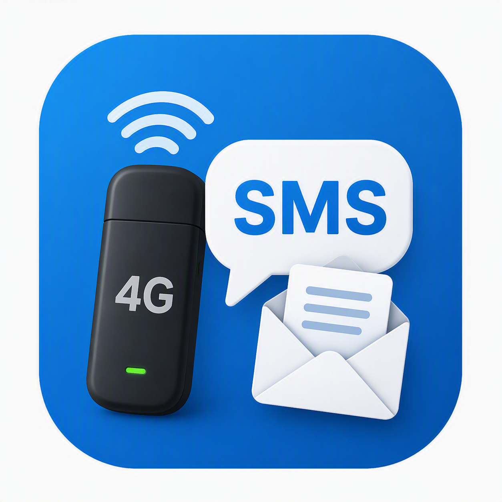

# WWAN SMS Manager

**Portable SMS client for Windows 10/11 Mobile Broadband (WWAN) modems.**

There is no built-in Windows 11 app to read, send, and delete SMS stored on a laptop/PC cellular modem (Fibocom, Intel XMM, Dell DW58xx, Quectel, etc.). This tool fills that gap using the Windows Mobile Broadband / SMS APIs — no Fibocom Mobile Manager, no AT COM ports required.



## Features

- **Read** SMS from the SIM / modem memory
- **Send** SMS to any number
- **Delete** selected messages or clear the modem inbox
- **Reassemble** multipart SMS (correct PDU decoding — no more `@@@@` garbage from padding)
- **Export** inbox to TXT / CSV
- **Single-file portable EXE** — no installer, copy and run
- Works with MBIM WWAN adapters managed by Windows

## Download

Grab the latest portable build from **[Releases](../../releases)** (`WwanSmsManager.exe`).

Or build from source (see below).

## Requirements

- Windows 10 or Windows 11
- A WWAN / Mobile Broadband modem with a SIM that Windows recognizes  
  (`Settings → Network & Internet → Cellular`)
- .NET Framework 4.x (included with Windows 10/11)

## Usage

1. Insert the SIM and wait until Windows shows the cellular interface
2. Run `WwanSmsManager.exe`
3. Click **Aggiorna** to load messages
4. Select a message to read / copy / delete
5. Use **Nuovo SMS** to send

> Tip: modem SMS storage is small (often ~20 messages). Older messages get overwritten.

## Build from source

On any Windows 10/11 PC with the .NET Framework targeting pack (comes with Windows):

```powershell
cd src
.\..\build.ps1
```

Or manually:

```powershell
$fx = "$env:WINDIR\Microsoft.NET\Framework64\v4.0.30319"
$wm = "C:\Windows\System32\WinMetadata"
& "$fx\csc.exe" /nologo /target:winexe /platform:anycpu /optimize+ `
  /out:..\release\WwanSmsManager.exe `
  /win32manifest:app.manifest `
  /win32icon:..\assets\app.ico `
  /resource:"$fx\System.Runtime.WindowsRuntime.dll,System.Runtime.WindowsRuntime.dll" `
  /reference:$fx\System.dll /reference:$fx\System.Core.dll `
  /reference:$fx\System.Drawing.dll /reference:$fx\System.Windows.Forms.dll `
  /reference:$fx\System.Runtime.dll /reference:$fx\System.Runtime.WindowsRuntime.dll `
  /reference:$wm\Windows.Foundation.winmd /reference:$wm\Windows.Devices.winmd `
  Program.cs
```

## Why this exists

On Windows 11 26H1+ / modern WWAN stacks, classic vendor “Mobile Manager” tools often fail (AT ports locked by `WwanSvc`, NetFx 3.5 changes, etc.).  
Windows itself can access SMS via WinRT (`Windows.Devices.Sms`), but ships **no UI**. This project is that UI.

## Compatible hardware (tested / expected)

| Modem | Notes |
|-------|--------|
| Dell DW5820e / Fibocom + Intel XMM7360 | Tested |
| Other MBIM WWAN (Fibocom, Quectel, Sierra, …) | Should work if Windows exposes SMS |

## License

MIT — see [LICENSE](LICENSE).

## Disclaimer

Use only on devices and SIMs you own or are authorized to manage. SMS content may include personal data; handle exports carefully.
