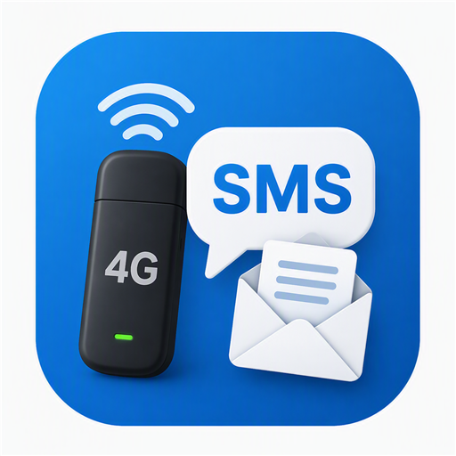

# WWAN SMS Manager

<p align="center">
  
</p>

<p align="center">
  <strong>🇮🇹 App Windows 10/11 per leggere e scrivere gli SMS dalla scheda 4G/LTE del PC</strong><br/>
  <strong>🇬🇧 Windows 10/11 app to read &amp; send SMS from your laptop’s built-in 4G/LTE modem</strong>
</p>

<p align="center">
  <a href="https://github.com/pannox/wwan-sms-manager/releases/latest"></a>
  <a href="LICENSE"></a>
  
  
</p>

---

## 🇮🇹 Italiano

### Cos’è

Programma per **Windows 11** (e Windows 10) che permette di **leggere, inviare e cancellare gli SMS** dalle **schede 4G/LTE integrate** nel computer (modem Mobile Broadband / WWAN).

Se hai un notebook con **SIM o eSIM** e modem cellulare (Fibocom, Intel XMM, Dell DW5820e, Quectel, …) e cerchi un’app tipo “Messaggi” per il PC: **è questo**.

Windows mostra la rete cellulare per i dati, ma **non ha un’app per gli SMS del modem**.  
I software tipo Fibocom / Dell Mobile Manager spesso **non funzionano più** su Windows 11.  
Questa app usa le API ufficiali di Windows ed è **portable** (un solo file `.exe`).

### A cosa serve (una frase)

> **Leggere e scrivere SMS dalla scheda 4G del PC su Windows 11**, come sul telefono.

### Funzioni

| | |
|--|--|
| **Leggere** | SMS salvati sulla SIM / memoria del modem |
| **Inviare** | Nuovi SMS a qualsiasi numero |
| **Cancellare** | Singoli messaggi o tutta la inbox del modem |
| **Esportare** | Salvataggio in TXT o CSV |
| **Portabile** | Nessuna installazione |

Gestisce anche gli SMS lunghi spezzati in più parti.

### Per chi è

- Chi ha un **PC Windows 11/10 con modem 4G** e SIM  
- Chi riceve **OTP, SMS operatore, notifiche** sul modem del laptop  
- Chi non riesce più a usare **Mobile Manager** del produttore  

### Download

**Pacchetto completo (consigliato):**  
**→ [`WwanSmsManager-1.0.0-win-portable.zip`](https://github.com/pannox/wwan-sms-manager/releases/latest)**

Oppure solo l’eseguibile:  
**→ [`WwanSmsManager.exe`](https://github.com/pannox/wwan-sms-manager/releases/latest)**

1. Scarica, estrai (se ZIP) e avvia  
2. Controlla che Windows veda il cellulare: `Impostazioni → Rete e Internet → Cellulare`  
3. Premi **Aggiorna** nell’app  

### Requisiti

- Windows 10 o **Windows 11**
- Modem **WWAN 4G/LTE** (integrato o USB) con SIM riconosciuta da Windows

---

## 🇬🇧 English

### What it is

A **Windows 10 / Windows 11** app to **read, send and delete SMS** from your PC’s **built-in 4G/LTE modem** (Mobile Broadband / WWAN).

Laptops with a cellular modem (Fibocom, Intel XMM, Dell DW5820e, Quectel, …) can use mobile data in Windows — but **there is no Messages app for WWAN SMS**. Vendor “Mobile Manager” tools often break on Windows 11. This fills that gap with a **portable single EXE**.

### One-liner

> **Read and send SMS from your laptop’s 4G card on Windows 11.**

### Features

| | |
|--|--|
| **Read** | SMS stored on SIM / modem memory |
| **Send** | New SMS to any number |
| **Delete** | Selected messages or clear modem inbox |
| **Export** | TXT / CSV |
| **Portable** | No installer |

Multipart SMS are reassembled with correct PDU decoding.

### Download

**→ [`WwanSmsManager.exe`](https://github.com/pannox/wwan-sms-manager/releases/latest)**

1. Download & run  
2. Ensure Windows sees Cellular: `Settings → Network & Internet → Cellular`  
3. Click **Aggiorna** (Refresh)  

### Requirements

- Windows 10 or **Windows 11**
- WWAN **4G/LTE** modem with a SIM recognized by Windows

---

## Hardware

| Modem | Status |
|-------|--------|
| Dell DW5820e / Fibocom + Intel XMM7360 | Tested |
| Other MBIM WWAN (Fibocom, Quectel, Sierra, …) | Expected to work if Windows exposes SMS |

## Build

```powershell
.\build.ps1
```

Output: `release\WwanSmsManager.exe`

## License

MIT — see [LICENSE](LICENSE).

## Disclaimer / Avvertenza

Use only on devices and SIMs you own. SMS may contain personal data — handle exports carefully.  
Usare solo su dispositivi e SIM propri. Gli SMS possono contenere dati personali.
